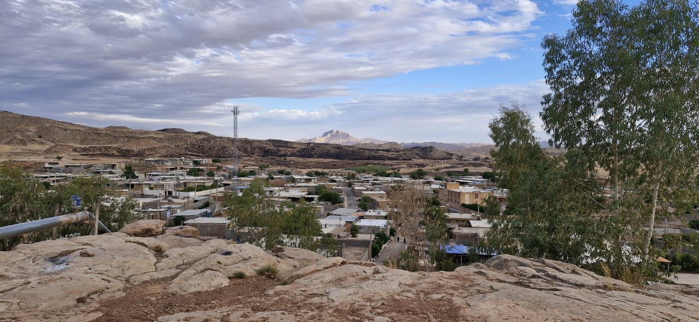

<!DOCTYPE html>
<html lang="fa">
<head>
    <meta charset="UTF-8">
    <meta name="viewport" content="width=device-width, initial-scale=1.0">
    <title>آبید - معرفی کامل روستای آبید در خوزستان</title>
    <meta name="description" content="روستای آبید، روستای بختیاری‌نشین استان خوزستان، شهرستان دزفول، بخش سردشت. معرفی کامل تاریخ، فرهنگ و طبیعت آبید.">
    
</head>
<body>
    

        <h1>روستای آبید</h1>
        
آبید یک روستای بختیاری‌نشین در استان خوزستان، شهرستان دزفول، بخش سردشت است. این روستا با طبیعت بکر، فرهنگ محلی و آرامش خاص خود، یکی از مقصدهای منحصر به فرد برای علاقه‌مندان به تاریخ و زندگی روستایی در خوزستان به شمار می‌آید.

        

        <h2>جغرافیا و موقعیت</h2>
        
روستای آبید در منطقه‌ای کوهستانی و نیمه‌کوهستانی واقع شده و اطراف آن با چشم‌اندازهای طبیعی و دشت‌های سرسبز احاطه شده است. این موقعیت جغرافیایی باعث شده تا آب و هوای منطقه معتدل و مناسب کشاورزی و دامداری باشد. رودخانه‌ها و چشمه‌های طبیعی آبید، یکی از منابع حیاتی مردم روستا برای تأمین آب و کشاورزی هستند.

        <h2>تاریخچه</h2>
        
آبید یکی از روستاهای تاریخی منطقه دزفول است که قدمت آن به چندین دهه و حتی قرن‌ها قبل بازمی‌گردد. مردم این روستا همواره با فرهنگ و آداب و رسوم محلی زندگی کرده‌اند و ارزش‌های سنتی خود را حفظ کرده‌اند. این روستا محل تجمع فعالیت‌های اجتماعی، مراسم محلی و جشن‌های بومی مردم است.

        <h2>فرهنگ و سنت‌ها</h2>
        
مردم آبید به فرهنگ بختیاری خود افتخار می‌کنند و این فرهنگ در زندگی روزمره، پوشش، غذاها، موسیقی و جشن‌ها مشاهده می‌شود. مراسم محلی و جشن‌های فصلی در این روستا با شور و نشاط برگزار می‌شوند و فرصتی برای انتقال سنت‌ها به نسل‌های بعدی فراهم می‌کنند.

        <h2>طبیعت و چشم‌انداز</h2>
        
آبید با چشم‌اندازهای طبیعی منحصر به فرد خود، شامل دشت‌ها، کوه‌ها، رودخانه‌ها و باغ‌ها، مکانی مناسب برای گردشگری روستایی است. بازدیدکنندگان می‌توانند از سکوت و آرامش طبیعت لذت ببرند و با سبک زندگی سنتی مردم روستا آشنا شوند.

        <h2>زندگی روزمره مردم</h2>
        
زندگی در آبید ترکیبی از کشاورزی، دامداری و فعالیت‌های سنتی است. مردم با تلاش و همکاری در امور روستا مشارکت دارند و روحیه همبستگی و کمک به یکدیگر در میان اهالی دیده می‌شود. این سبک زندگی سنتی، نشانه‌ای از فرهنگ و هویت بومی آبید است.

        <h2>گردشگری و بازدید</h2>
        
روستای آبید مقصدی مناسب برای کسانی است که به دنبال تجربه زندگی روستایی، فرهنگ محلی و طبیعت بکر هستند. گردشگران می‌توانند با مردم محلی دیدار کنند، از مناظر طبیعی لذت ببرند و تجربه‌ای متفاوت از زندگی شهری داشته باشند.

        <h2>هدف سایت</h2>
        
این سایت با هدف معرفی کامل زیبایی‌ها، فرهنگ و تاریخ روستای آبید طراحی شده است تا بازدیدکنندگان با این روستای بختیاری‌نشین خوزستان آشنا شوند و اطلاعات دقیقی درباره تاریخ، جغرافیا، فرهنگ و زندگی مردم آن کسب کنند.

    

</body>
</html>
